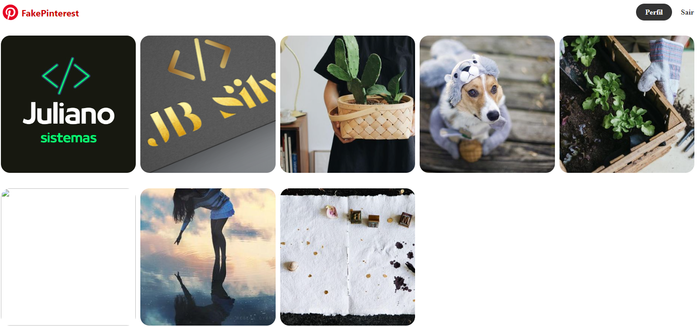

Claro, aqui está um exemplo de um arquivo README para o seu projeto fictício de um site inspirado no Pinterest, desenvolvido durante seus estudos na Hashtag Treinamentos com Python e Flask:

# Projeto Fake Pinterest - Hashtag Treinamentos

Este é um projeto fictício de um site inspirado no Pinterest, criado como parte do meu aprendizado com Python e Flask na Hashtag Treinamentos. Este projeto tem como objetivo demonstrar minhas habilidades de desenvolvimento web e é totalmente fictício, não tendo relação com o Pinterest oficial.

## Visão Geral

O Fake Pinterest é uma aplicação web desenvolvida usando Python e o framework Flask. Ele permite aos usuários:

- Criar uma conta e fazer login.
- Navegar por uma variedade de imagens fictícias.
- Adicionar imagens aos seus próprios "boards".



## Requisitos

Antes de executar este projeto em sua máquina local, certifique-se de ter o seguinte instalado:

- Python 3.x: [Download Python](https://www.python.org/downloads/)

## Configuração do Ambiente

1. Clone este repositório para a sua máquina local usando o seguinte comando:

   ```
   https://github.com/JBSilvaDev/Python-FakePinterest.git
   ```

2. Navegue até o diretório do projeto:

   ```
   cd fake-pinterest
   ```

3. Crie um ambiente virtual para o projeto (recomendado):

   ```
   python -m venv venv
   ```

4. Ative o ambiente virtual:

   - No Windows:

     ```
     venv\Scripts\activate
     ```

   - No macOS e Linux:

     ```
     source venv/bin/activate
     ```

5. Instale as dependências do projeto:

   ```
   pip install -r requirements.txt
   ```

## Executando o Projeto

Para iniciar o servidor Flask, execute o seguinte comando:

```
python main.py
```

O site estará disponível em [http://127.0.0.1:5000/](http://127.0.0.1:5000/) no seu navegador.

## Contribuindo

Este projeto é apenas para fins educacionais e não aceitamos contribuições externas.

## Autor

- JB Silva
- Contato: jbsilva.dev@outlook.com

## Licença

Este projeto é distribuído sob a licença MIT. Consulte o arquivo [LICENSE](./LICENSE) para obter mais informações.

---

**Nota:** Este projeto é fictício e tem apenas fins de aprendizado. Não possui relação com o Pinterest oficial e não deve ser usado para qualquer finalidade comercial ou real.